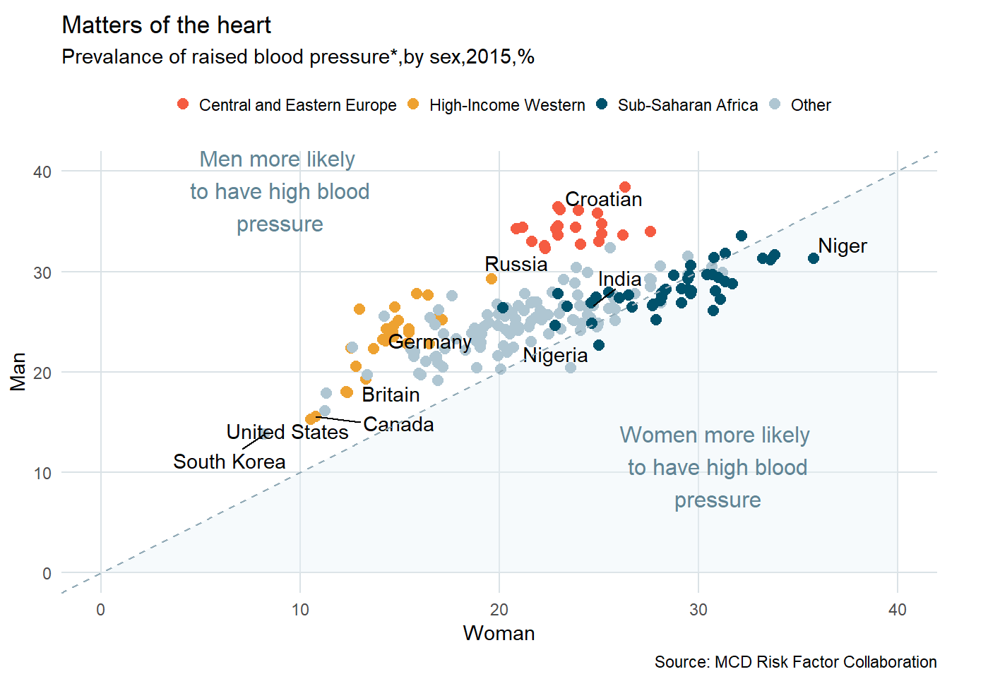

# The Economist's Plot

[The Economist](https://www.economist.com/) is a British digital newspaper that mainly focused on economy, politics, technology, culture, and current affairs. 
It is also known for its simple but impactful data visualization.

This project is my attempt to duplicate [this](https://github.com/Steven-Surya/economist-plot/blob/main/20170124_WOC500_2.png) plot from The Economist using `ggplot` package in R.
This is one of my project as an intern at [Algoritma Data Science School](https://algorit.ma/). 
The following plot is the final result of this project.

For HTML version of the code and the result, click [here](https://www.rpubs.com/Steven_Surya/economist-plot).
